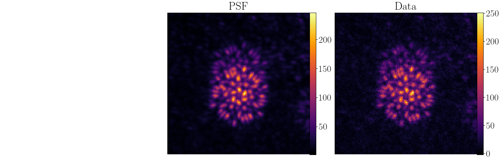
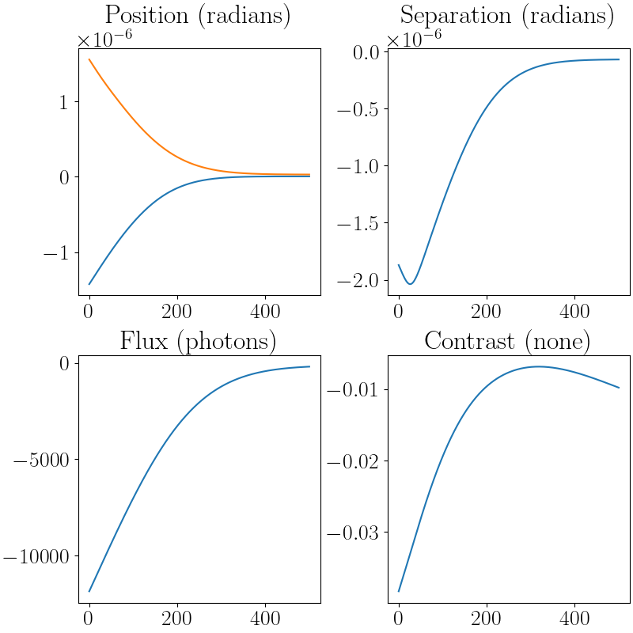

## Gradient Descent
The current plan for the extraction pipeline is to use gradient descent to 
find the starting state for Hamiltonian Monte Carlo (HMC). In this notebook,
we cover a simple, low parameter optimisation using `optax`.

```python 
import jax
import jax.numpy as np
import jax.lax as jl
import jax.random as jr
import toliman
import toliman.constants as const
import toliman.math as math
import matplotlib as mpl
import matplotlib.pyplot as plt
import tqdm.notebook as tqdm
import dLux
import optax
import equinox
import os
```

Next, we organise the housekeeping; i.e. collecting true values, setting 
the working directory and chosing graphics. The working directory needs 
to be set in the directory that contains `.assets` or where-ever you told
toliman to install the datafiles.

```python 
mpl.rcParams["text.usetex"] = True
mpl.rcParams["font.family"] = "serif"
mpl.rcParams["font.serif"] = "Times New Roman"
mpl.rcParams["font.size"] = 20.0
mpl.rcParams["image.cmap"] = "inferno"

true_separation: float = const.get_const_as_type("ALPHA_CENTAURI_SEPARATION", float)
true_position: float = const.get_const_as_type("ALPHA_CENTAURI_POSITION", np.ndarray)
true_pixel_scale: float = const.get_const_as_type("TOLIMAN_DETECTOR_PIXEL_SIZE", float)
true_flux: float = const.get_const_as_type("ALPHA_CENTAURI_MEAN_FLUX", float)
true_contrast: float = const.get_const_as_type("ALPHA_CENTAURI_CONTRAST", float)

os.chdir("..") # Specific for our installation.
```

Now we can create our model. Since, this is an example, we are keeping things
simple and just simulating the physical telescope and the mask without 
adding zernike polyomials. Since, we are not trying to learn the positions
etc., of the pupil we will set it to static using the `operate_in_static_mode`
flag. This is much faster than using a dynamic pupil.

```python 
model: object = dLux.Instrument(
    optics = toliman.TolimanOptics(operate_in_static_mode = True),
    detector = toliman.TolimanDetector(),
    sources = [toliman.AlphaCentauri(), toliman.Background(number_of_bg_stars = 5)]
)
```

!!! note 
    Be careful with the background stars. Although we tried to get a "typical"
    sample using the Gaia database, we had trouble working out the relative 
    brightness. Gaia does not cope that well with bright stars so it very much 
    underestimated the brightness of Alpha Centarui. We had a rather commical 
    hole in the field of stars where Alpha Centarui was but a low brightness 
    for the actual star. **We have used this value** so make sure that you 
    manually check the PSF and adjust the brighness of the background stars 
    if you think it is necessary. This can be done using:

    ```python 
    model.set("MultiPointSource.flux", model.get("MutliPointSource.flux") * ...)
    ```

Now let's simulate some data and plot the results. 

```python 
psf: float = model.model()
data: float = math.simulate_data(psf, 1)

def im_and_cbar(figure: object, image: float, pos: int, title: str, naxes: int) -> object:
    cbar_pad: float = 0.05
    cbar_width: float = 0.0125
    width: float = 1.0 / naxes - cbar_pad
    disp: float = cbar_pad / 2.0 * naxes
    height: float = 1.0 - 2.0 * disp
    corner: float = float(pos) / float(naxes)
    im_ax: object = figure.add_axes([corner, disp, width, height])
    cbar_ax: object = figure.add_axes([corner + width, disp, cbar_width, height])
    im_cmap: object = im_ax.imshow(image)
    im_cbar: object = figure.colorbar(im_cmap, cax = cbar_ax)
    im_xticks: object = im_ax.axis("off")
    im_title: object = im_ax.set_title(title) 
    return figure

scale: float = 5.0
naxes: int = 3
figure: object = plt.figure(figsize = (naxes * scale, scale))
figure: object = im_and_cbar(figure, psf, 1, "PSF", 3)
figure: object = im_and_cbar(figure, data, 2, "Data", 3)
figure: object = im_and_cbar(figure, data - psf, 3, "Residuals", 3)
```



We are interested in the parameters of the Alpha Centauri object ignoring 
the field angle. However, we do not want to use the model we used to generate
the data to perform the gradient descent. Instead we want to perturb the 
relevant parameters a little. I generated my perturbations by considering 
how well the results could be eyeballed. I thought I could probably get the 
position to within a pixel each way and then for the sake of completeness 
assumed a gaussian error. Separation, contrast and flux followed similar 
reasoning.

!!! note 
    We are ignoring the field angle to match the HMC example.

!!! tip
    The `params` variable is a set of paths that `Zodiax` can use to 
    access/update the parameters of the model. The perturbations 
    are the changes that we want to apply in the same order. It is 
    easy to loose track of which element of the list references which
    parameter and my solution to this problem is to define constants
    that I can use for indexing. For example,

    ```python 
    data: list = ["fish", "mamal", "bird"]
    FISH: int = 0
    MAMAL: int = 1
    BIRD: int = 2

    data[FISH] = "fish"
    data[MAMAL] = "mamal"
    ```

    This only works while the list is not changed. If someone were to 
    mutate the list then your indexing would break.

```python 
params: list = [
    "BinarySource.position",
    "BinarySource.separation",
    "BinarySource.flux",
    "BinarySource.contrast"
]

perturbations: list = [
    true_pixel_scale * jr.normal(jr.PRNGKey(0), (2,)),
    5 * true_pixel_scale * jr.normal(jr.PRNGKey(0), ()),
    0.1 * true_flux * jr.normal(jr.PRNGKey(1), ()),
    0.1 * true_contrast * jr.normal(jr.PRNGKey(2), ()),
]

optimizers: list = [
    optax.adam(learning_rate = 0.005 * true_pixel_scale),
    optax.adam(learning_rate = 0.005 * true_pixel_scale),
    optax.adam(learning_rate = 0.0005 * true_flux),
    optax.adam(learning_rate = 0.0001 * true_contrast),
]

POSITION: tuple = (0, 1)
SEPARATION: int = 2
FLUX: int = 3
CONTRAST: int = 4
```

You may notice that my constants don't quite make sense and that is 
because `position` counts as an `x` and a `y` parameter. We will see 
this is useful later in indexing arrays. 

!!! tip
    `jax` arrays can be indexed by tuples. 

    ??? example
        ```python 
        >>> import jax.numpy as np
        >>> arr: float = np.zeros((5, 5), dtype = float)
        >>> arr[:, (0, 1)].shape
        ::: (5, 2)
        ```

Now let's define the loss function. In this case I am doing a simple 
chi-squared loss. I would recommend using a different syntax for the 
code, I just got carried away telling the computer what to do instead 
of focussing on the science. The important things to take note of are
`model.get_args` and `equinox.filter_value_and_grad` and `equinox.filter_jit`.

!!! tip
    `equinox.filter_jit` will mark all the parts of the model that `jax` 
    would break on as static preventing compilation errors. 
    `equinox.

```python 
@equinox.filter_jit
@equinox.filter_value_and_grad(arg = model.get_args(paths = params))
def eval_loss(model: object, data: float) -> float:
    psf: float = model.model()
    res: float = psf - data
    sq_err: float = jl.integer_pow(res, 2)
    loss: float = jl.reduce(sq_err, 0.0, jl.add, (0, 1))
    return loss
```

Finally, we can set up the gradient descent loop. First we add our perturbations
to the model using the `zodiax` `add` syntax. Then we use the `zodiax` 
`get_optimiser` syntax to generate the appropriate `optax.optim` object.
Since I am interested in the first and last state of the model I make an 
implicit copy of the initial state that I will use in the learning model.
Finally, we set up the residuals from the known global minimum as an array.

```python 
perturbed_model: object = model.add(params, perturbations)
optimizer, opt_state = perturbed_model.get_optimiser(params, optimizers)
learning_model: object = perturbed_model # Implicit copy
full_residuals: float = np.hstack(learning_model.get(params)) - np.hstack(model.get(params))
```

Now we run the learning loop for `500` iterations and collect the residuals 
at each epoch. We are interested in the residuals so that we can analyse our
choice of learning rate. The updates are applied using the 
`equinox.apply_updates` function. 

```python 
with tqdm.tqdm(range(500)) as t:
    for i in t:
        # calculate the loss and gradient
        loss, grads = eval_loss(learning_model, data)

        # apply the update
        updates, opt_state = optimizer.update(grads, opt_state)
        learning_model: object = equinox.apply_updates(learning_model, updates)

        residuals: float = np.hstack(learning_model.get(params)) - np.hstack(model.get(params))
        full_residuals: float = np.vstack([full_residuals, residuals])

        t.set_description('Loss %.5f' % (loss)) # update the progress bar
```

Finally, let's check our learning rates by plotting the residuals. 

!!! tip
    Your learning rate should be a small percentage of the perturbation'
    from the true value. Obviously in practice you don't know what the 
    the perturbation is, but one can assume that it is a small percentage 
    of the true value. If the residuals "bounce" around then the learning 
    rate is likely too high. 

```python 
epochs: float = np.arange(full_residuals.shape[0])
figure: object = plt.figure(figsize=(8, 8), constrained_layout=True)
axes: object = figure.subplots(2, 2)
axes[0][0].plot(epochs, full_residuals[:, POSITION])
axes[0][0].set_title("Position (radians)")
axes[0][1].plot(epochs, full_residuals[:, SEPARATION])
axes[0][1].set_title("Separation (radians)")
axes[1][0].plot(epochs, full_residuals[:, FLUX])
axes[1][0].set_title("Flux (photons)")
axes[1][1].plot(epochs, full_residuals[:, CONTRAST])
axes[1][1].set_title("Contrast (none)")
```


